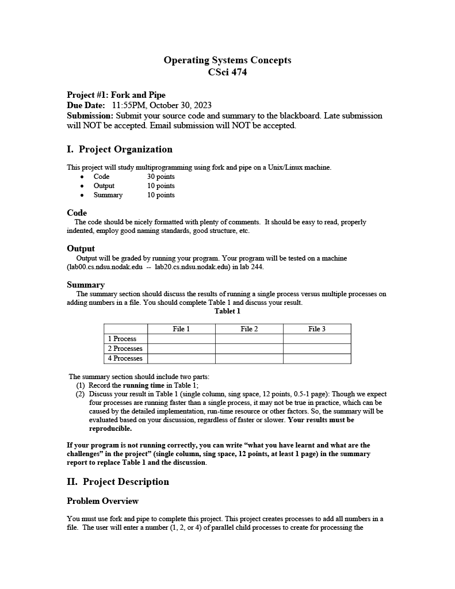
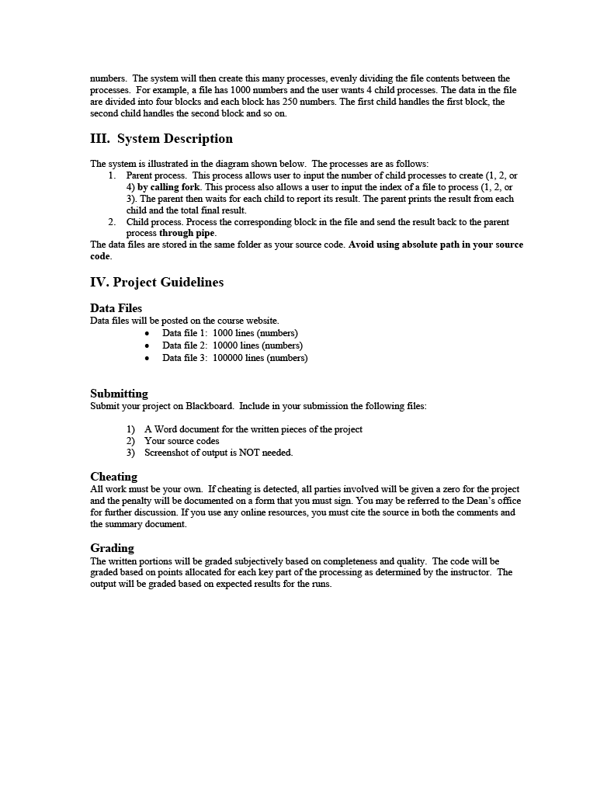

# CSCI-474-Project1

This project is about creating a multiprocess program that uses fork and pipe to read a file

# These are the requirments for the project

  

  

# How to run
Note: This program can only run on Linux Distros.

#
